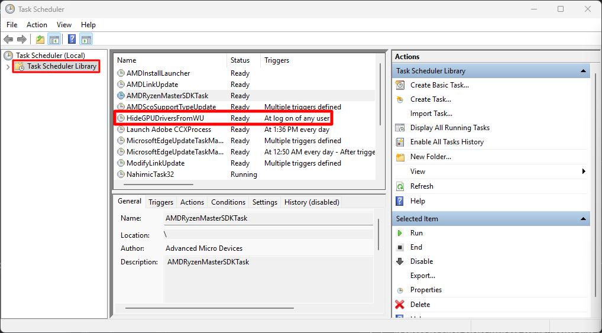

# WUShowHideToolAlt

## Why I Created This Project
### Background:
Maintaining a Windows system often involves repetitive tasks that can be tedious and time-consuming. I noticed that Windows annoyingly installs outdated GPU drivers through Windows Update. These issues have impacted system performance and stability.

### The Problem:
**Windows Update** has a ***habit of installing older or unwanted GPU drivers***, which can sometimes lead to compatibility issues, crashes, or performance degradation.


## Overview

This script performs a series of maintenance tasks on a Windows system, including cleaning up temporary files, disabling Delivery Optimization, and hiding old GPU drivers from Windows Update. The script performs the following actions:

1. **Administrative Privileges Check**: Ensures the script is running with administrative privileges. If not, it restarts itself with elevated permissions.
2. **Disk Cleanup**: Configures and runs the Disk Cleanup tool (`cleanmgr`) with specific cleanup options.
3. **Delivery Optimization Service**: Disables the Delivery Optimization service to prevent unnecessary background data transfer.
4. **SoftwareDistribution Folder Cleanup**: Takes full ownership, cleans up the SoftwareDistribution folder and restore default ownership.
5. **GPU Driver Hiding**: Installs the PSWindowsUpdate module (if not already installed) and hides old GPU drivers from Windows Update.
6. **Scheduled Task Creation**: Saves a script to hide old GPU drivers and schedules it to run at logon.


## Script Components

### Administrative Privileges Check

The script first checks if it's running as an administrator. If not, it attempts to restart with elevated privileges.

### Disk Cleanup

The script sets specific cleanup options and runs `cleanmgr` to perform disk cleanup. After cleanup, it removes the state flags from the registry.

### Delivery Optimization Service

The script disables the Delivery Optimization service by setting its startup type to disabled.

### SoftwareDistribution Folder Cleanup

The script stops Window Update services, takes ownership of the `SoftwareDistribution` folder, deletes its contents with a retry mechanism, and restores the folder’s ownership to default settings.

### GPU Driver Hiding

The script installs and uses the `PSWindowsUpdate` module to hide old GPU drivers from Windows Update.

### Scheduled Task Creation

A scheduled task is created to run a PowerShell script at logon that hides old GPU drivers from Windows Update.

## Prerequisites

- PowerShell
- Administrative privileges
- `PSWindowsUpdate` PowerShell module (installed by the script if not present)

## How to Use
1. Download instructions for the script:
    - If you want to download the entire repository, you can do so by cloning it using Git or by downloading it as a ZIP file.
    - **To download as a ZIP file**:
        - On the main repository page, click the **Code** button (usually green) and select **Download ZIP**.
        - Extract the ZIP file to access the `WUShowHideToolAlt.ps1` script.
    - **To clone using Git**:
        - Open Git Bash or a terminal.
        - Run the following command:

          ```bash
          git clone https://github.com/hexagonal717/wushowhidetoolalt
          ```

        - This will clone the entire repository to your local machine, and you can access the `WUShowHideToolAlt.ps1` script.
      ####
2. Make sure you have an ***internet connection*** while running the script. The script depends upon Windows Update to retrieve the Old drivers from server so that we can block the old drivers.  
3. **Pause Windows Update** in Settings > Windows Update > Pause (pause for 1 week).
4. Open Windows Terminal or CMD.
5. Copy and paste the following code:
    #### `Put your path of the WUShowHideToolAlt.ps1 file inside the double quotes.`
    ```bash
    powershell.exe -ExecutionPolicy Bypass -File "C:\Path\To\Your\Script\WUShowHideToolAlt.ps1"
    ```
6. You will be prompted to install `PSWindowsUpdate` Module for powershell if needed. Type `Y` and press enter.
7. The script will perform its tasks automatically and create a scheduled task for future automatic executions.
8. The script will take around 3 minutes or so to finish executing. Be patient.
9. ### Important!
    ### Run DDU (Display Driver Uninstaller)
    #### Instructions in the video below:
      `(Do the DDU safe mode method.)`
   #### [How to download and use DDU (Display Driver Uninstaller)](https://youtu.be/1XlwirtWs_c?si=aw5g3N4NUi8TGURM&t=142)
10. #### Download and install your appropriate GPU driver after reboot from DDU. 
    - Download Latest GPU driver from:
       - ***AMD*** - (https://www.amd.com/en/support/download/drivers.html)
         #### (***Also download Chipset drivers along with GPU drivers for AMD.***)
       - ***Nvidia*** - (https://www.nvidia.com/download/index.aspx)
       - ***Intel*** - (https://www.intel.com/content/www/us/en/download-center/home.html)
11. You can enable back Windows Update.
12. If everything is done right, there will be a `HideOldGPUDriversFromWU.ps1` file in the ***root of your C: Drive*** and task named `HideOldGPUDriversFromWU` in ***Task Scheduler***. See images below:
      ### `HideOldGPUDriversFromWU.ps1` file in C: Drive:
      

      ### `HideOldGPUDriversFromWU` task in Task Scheduler:
      
      - ### Caution
        #### Do not move `HideOldGPUDriversFromWU.ps1` file placed in the root of C: Drive. It is essential for the Task Scheduler for the automation of the script.
## License
This project is licensed under the MIT License - see the LICENSE file for details.